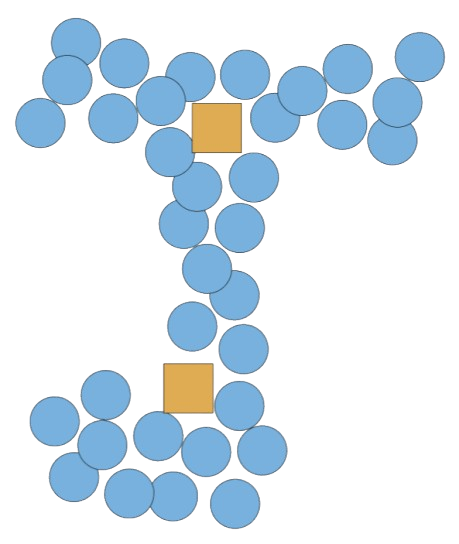

# Forge Explorer

Explorateur graphique de la **Forge Apps Éducation** (instance GitLab) : **sujets (topics)**, **projets**, **groupes** et **utilisateurs**, sous forme de **graphe interactif**.

<p align="center">
  
</p>

---
## Sommaire

- [Apercu](#apercu)
- [Fonctionnalites](#fonctionnalites)
- [Demarrage rapide](#demarrage-rapide)
- [Architecture](#architecture)
- [Librairie interne : `ngx-forge-map` (graphe + API)](#librairie-interne-ngx-forge-map-graphe-api)
- [Configuration API](#configuration-api)
- [Credits](#credits)


---

## Apercu

Forge Explorer est une application web Angular 19 qui permet d’explorer la Forge Apps Éducation sous forme de graphe :

- Explorer par sujets : chercher un topic, puis ouvrir la liste/les projets associés.
- Explorer par projets : rechercher un projet et étendre le graphe
(projets <-> utilisateurs <-> groupes).
- Consulter les détails : panneau à droite (description, README, membres, lien Forge).
- Partager : générer un lien qui restaure la vue (URL compressée).


Forge ciblee : https://forge.apps.education.fr

---

## Fonctionnalites

### Vue Sujets 
- Recherche (minimum **3 caracteres**).
- Liste + graphe des topics.
- Ouverture de la vue Projets filtre (double-clic sur un topic ou bouton **Explore**).

### Vue Projets
- Recherche (minimum **3 caracteres**) si pas de filtre topic.
- Si vous arrivez avec déja un topic (sujet), la vue charge **uniquement** les projets de ce topic.
- Interactions graphe :
  - **clic simple** : selection du noeud + panneau d’inforomation,
  - **double-clic** : extension du graphe,
  - **multi-selection** : possible, pour etendre/masquer en lot,
  - touche **Delete** : masquer la selection.

- Panneau d’information (selon le type) :
  - **Projet** : description (si présent), README (si présent), lien vers la forge.
  - **Groupe** : description, membres.
  - **Utilisateur** : projets associes + lien profil.

### Barre d’outils / aide
- Actions rapides (etendre, masquer, copier le lien, aide).
- Panneau d’aide intégré activable via la barre d'outils en bas.

---

## Demarrage rapide

> Important : l’app depend d’une librairie workspace (`ngx-forge-map`) referencee via `tsconfig.json` vers `dist/ngx-forge-map`.
> Il faut donc **builder la librairie** avant de lancer l’app.

```bash
# 1) Installer
npm install

# 2) Builder la librairie (obligatoire)
npx ng build ngx-forge-map
# ou (equivalent)
# npm run build -- ngx-forge-map

# 3) Lancer le serveur de dev
npm run start
# puis ouvrir http://localhost:4200

#lancer les test
`ng test` | tests unitaires (Karma/Jasmine) 

```
---

## Architecture

### Application Angular
- `src/app/pages/accueil-page/` : accueil (choix Sujets/Projets + explications).
- `src/app/pages/topics-page/` : vue Sujets.
- `src/app/pages/projects-page/` : vue Projets (graphe + toolbar + panneaux).
- `src/app/services/url-manager/` : compression/decompression des URLs (partage).

### Librairie workspace
- `projects/ngx-forge-map/` : package `ngx-forge-map` (0.0.2)
  - `GraphForge` : wrapper autour de `vis-network`.
  - Services API : `ProjectApiService`, `GroupApiService`, `TopicApiService`, `UserApiService`.

### Assets & build output
- `assets/` : icones + images (utilisees par l’app).
- `public/forge-explorer/` : **output de build**.

---

## Librairie interne ngx forge-map graphe api

Ce projet contient une librairie Angular interne (`projects/ngx-forge-map`) qui sert à deux choses :

1) **Afficher le graphe**
- `GraphForge` : crée/affiche les nœuds et les liens (vis-network)
- `NodeType` : types de nœuds (projet, utilisateur, groupe, sujet)

2) **Récupérer les données depuis la Forge**
- Services :
  - `ProjectApiService` (projets + README)
  - `GroupApiService` (groupes + membres)
  - `TopicApiService` (sujets/topics)
  - `UserApiService` (utilisateurs + projets)

3) **Types de données**
- Models : `Project`, `Group`, `Topic`, `User`

## Configuration-api
Les URLs REST/GraphQL sont définies ici :
`projects/ngx-forge-map/src/lib/services/api.service.ts`

Par défaut l’app pointe vers :
- REST : `https://forge.apps.education.fr/api/v4`
- GraphQL : `https://forge.apps.education.fr/api/graphql`

---

## Credits

Projet Forge Explorer realise dans le cadre d’une SAE (BUT Informatique).
Auteurs :
- Tangi Beneat
- Nithael Bonnaud
- Thomas Friquet

Avec la collaboraiton de Marfisi Iza et Forest Thierry

